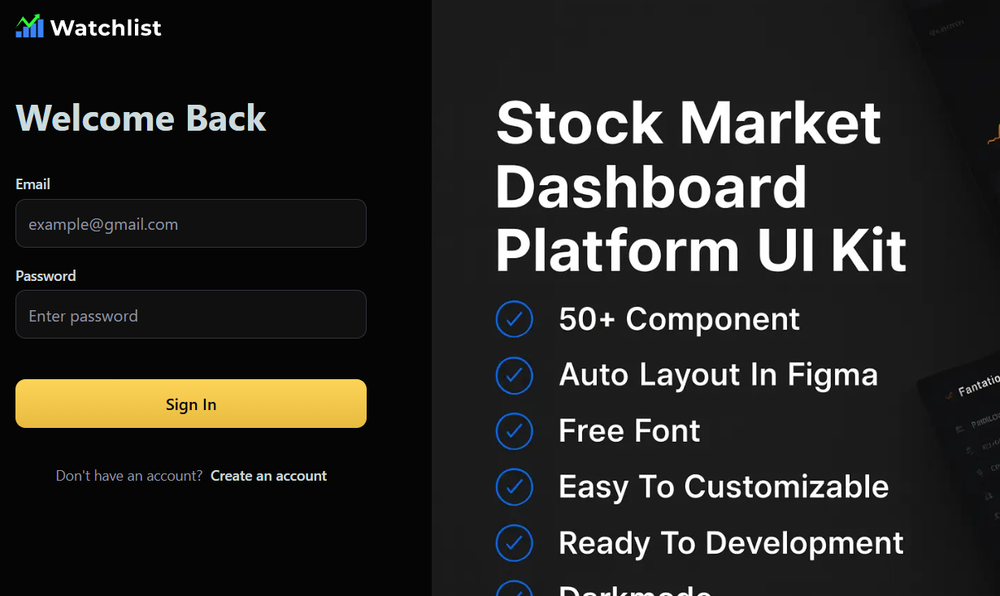

## Watchlist Market App

Watchlist is a modern stock market web application built with Next.js, designed to help users track their favorite stocks, receive daily market news, and manage personalized watchlists. The app features robust authentication, real-time updates, and automated email notifications.

### Tech Stack

- **Next.js** (App Router, SSR, API routes)
- **React** (19.x)
- **Tailwind CSS** (UI styling)
- **Radix UI** (UI primitives)
- **Zustand** (state management)
- **betterAUTH** (authentication: sign up, sign in, sign out)
- **MongoDB & Mongoose** (database & models)
- **Inngest** (background tasks, scheduled jobs)
- **Nodemailer** (email delivery)
- **Lucide React** (icons)
- **React Hook Form** (forms)
- **Sonner** (toast notifications)
- **CMDK** (command palette)
- **Finnhub Stock API** (real-time quotes, company fundamentals, financial data)

### Features & Highlights

- **User Authentication:** Secure sign up, sign in, and sign out powered by betterAUTH and MongoDB.
- **Watchlist Management:** Add, remove, and view stocks in your personal watchlist. Data is persisted in MongoDB.
- **Stock Search & Tracking:** Search for stocks and add them to your watchlist. View company details and market data.
- **Daily News Summary:** Automated daily emails with personalized market news, powered by Inngest and Nodemailer.
- **Sign Up Welcome Email:** New users receive a personalized welcome email with investment profile highlights.
- **Alerts & Notifications:** Create custom price alerts (UI mockup, extendable).
- **Responsive UI:** Built with Tailwind CSS and Radix UI for a modern, accessible experience.
- **Command Palette:** Quickly search stocks and navigate the app using CMDK. Ctrl + K
- **Photos/GIFs:** Add screenshots or GIFs in the `/public` folder to showcase features and UI.

### Folder Structure Overview

- `/app` — Next.js app directory (pages, layouts, API routes)
- `/components` — UI components, forms, and utilities
- `/database` — MongoDB connection and models
- `/lib` — Business logic, actions, authentication, background tasks
- `/public` — Static assets, icons, photos, GIFs
- `/store` — Zustand state management
- `/types` — TypeScript global types

### Authentication

Authentication is handled by betterAUTH, integrated with MongoDB. Users can sign up and sign in securely. Session management and user profile data are persisted in the database.

### Background Tasks & Emails

Inngest is used to run background jobs:

- **Sign Up Email:** Sends a personalized welcome email to new users.
- **Daily News Summary:** Sends daily market news emails to all users, personalized based on their watchlist.

Nodemailer handles email delivery, using custom HTML templates for a professional look.

### Watchlist & Market Data

Users can search for stocks, add them to their watchlist, and view market data. The watchlist is stored in MongoDB and displayed in a responsive table. Alerts and news are shown alongside tracked stocks.

---

> **Tip:** Add photos or GIFs to the `/public` folder and reference them in this README to showcase the app's UI and features.

---

## 📸 Project Gallery

### Static Overviews

<p align="center">
  
  
</p>

### Interactive Demos

<p align="center">
  
  
</p>

---

## Getting Started

First, run the development server:

```bash
npm run dev
# or
yarn dev
# or
pnpm dev
# or
bun dev
```

Open [http://localhost:3000](http://localhost:3000) with your browser to see the result.

You can start editing the page by modifying `app/page.tsx`. The page auto-updates as you edit the file.

---

## Learn More

- [Next.js Documentation](https://nextjs.org/docs)
- [Learn Next.js](https://nextjs.org/learn)
- [Next.js GitHub repository](https://github.com/vercel/next.js)

## Deploy on Vercel

The easiest way to deploy your Next.js app is to use the [Vercel Platform](https://vercel.com/new?utm_medium=default-template&filter=next.js&utm_source=create-next-app&utm_campaign=create-next-app-readme).

Check out [Next.js deployment documentation](https://nextjs.org/docs/app/building-your-application/deploying) for more details.
